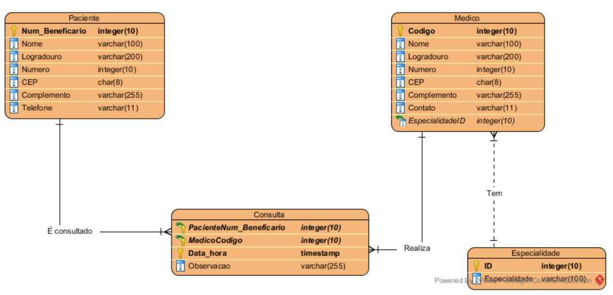
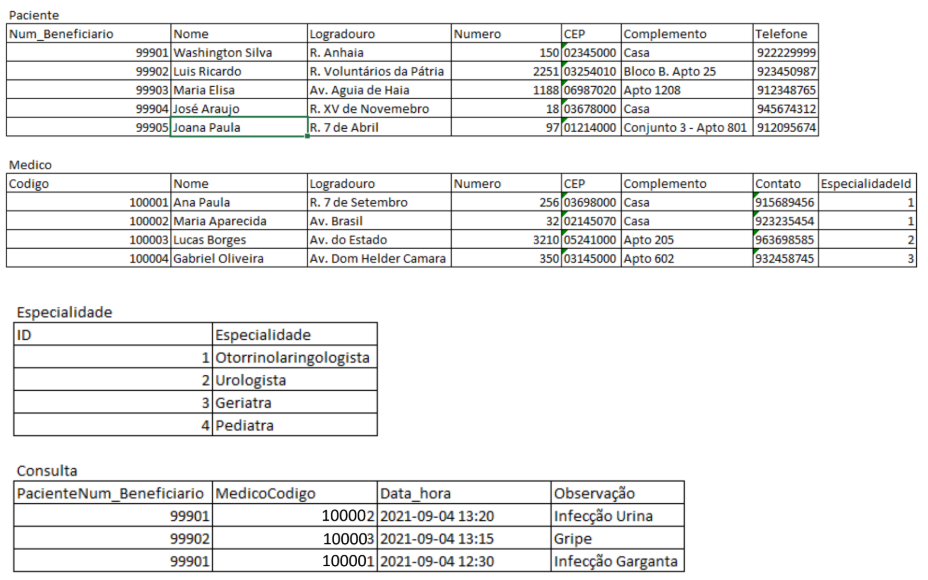

# Exercício
<ol>
  <li> Criar a database conforme o diagrama abaixo: </li>
  Database: Clinica
  
  
  <li> Inserir os dados, conforme as tabelas abaixo: </li>
  
  <li> Adicionar a coluna dia_atendimento para médico </li>
  
  <ul>
    <li>100001 – Passa a atender na 2a feira</li>
    <li>100002 – Passa a atender na 4a feira</li>
    <li>100003 – Passa a atender na 2a feira</li>
    <li>100004 – Passa a atender na 5a feira</li>
    Atualizar todos
  </ul>

<li> A especialidade Pediatra não está disponível. Excluir </li>
<li> Renomear a coluna dia_atendimento para dia_semana_atendimento </li>
<li> Atualizar os dados do médico Lucas Borges que passou a residir à Av. Bras Leme, no. 876, apto 504, CEP 02122000 </li>
<li> Mudar o tipo de dado da observação da consulta para VARCHAR(200) </li>
</ol>
